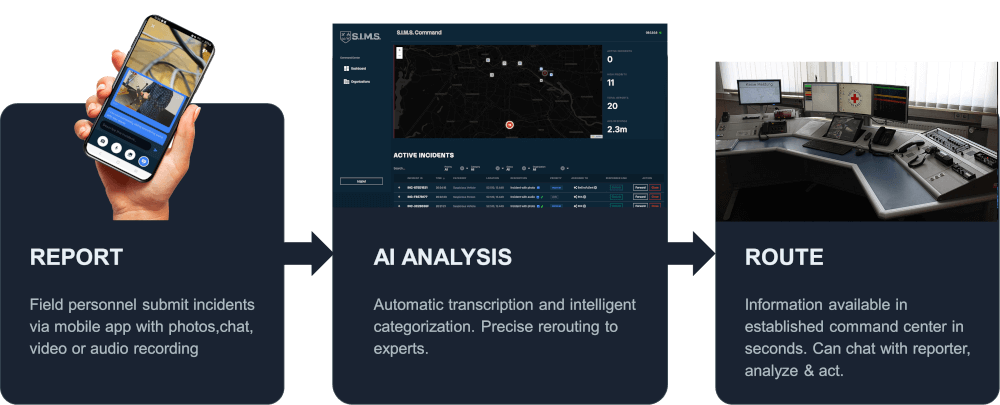
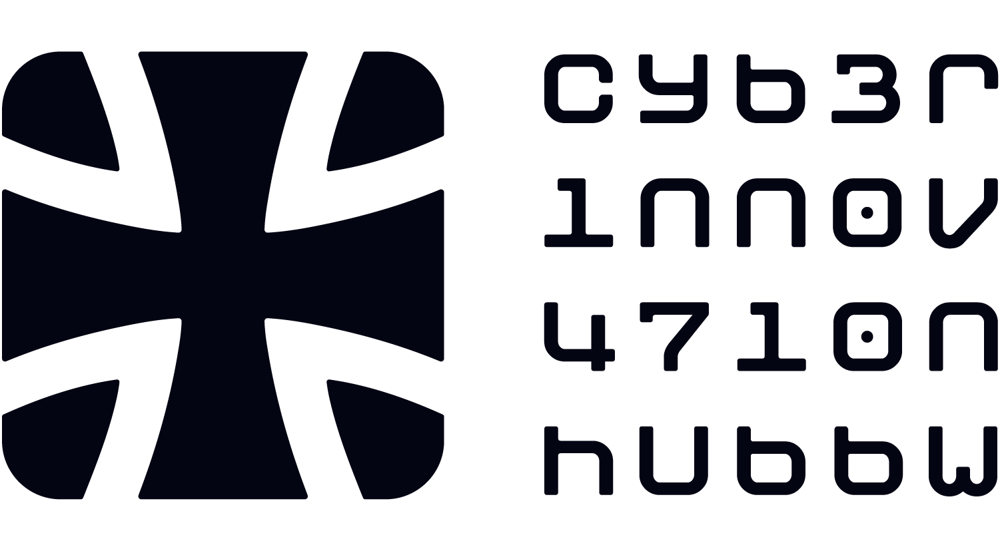

<div align="center">
  
</div>

# SIMS - Situation Incident Management System

## Overview

SIMS (Situation Incident Management System) is a dual-use (military and civilian) incident alert tracking system that enables fast reporting of threats, drones, and emergency situations directly to an orchestration layer, bypassing traditional reporting chains.

## Problem Statement

Traditional reporting chains are too slow for real-time situational awareness. People often don't know how to report incidents properly, and there is a critical need for a fallback system for unknown incident types. This system provides direct reporting capability for both military and civilian use cases.

## Key Features


<div align="center">
  
</div>


- **Fast Reporting**: Submit incidents in under a few seconds via mobile apps (Android / iOS), or per webhook (could be used to send from whatsapp to server using [Zapier](https://zapier.com) or similar)
- **Configurable Integrations**: Flexible input and output methods via integration templates
  - Multiple input channels: Mobile app, webhooks, email, SMS, WhatsApp
  - Multiple output channels: Webhooks, SEDAP, n8n, email, SMS, custom APIs
  - Organization-specific routing and filtering
  - Template-based payload customization
- **Operator Dashboard**: Real-time visualization and alert management
- **Responder Terminal**: Optional single-use response chat window for easy interaction with user (secured by one-time token, included in push data)
- **Automatic Location Capture**: GPS coordinates and device bearing/orientation
- **Multi-Modal Input**: Support for photos, voice messages, and text
- **AI Processing**: Voice-to-text transcription and LLM-based summarization
- **Intelligent Classification**: Automatic incident categorization and routing

## Use Cases

### Civilian Scenarios
- Armored vehicle sightings: Capture coordinates and photos for forwarding
- Airport drone detection: Quick photo and voice message reporting
- Natural disasters: Flooding, dam breaks - rapid photo submission

### Military Scenarios
- Drone detection: Soldier reports suspected drone near barracks
- Threat identification: Real-time situational awareness for patrol units


## Project Status

* sims-app:
  * **Android**: Core functionality is largely complete, including registration, permission management, dashboard, real-time updates via WebSocket, and chat interface.  
    *Outstanding*: Push notifications and live chat updates.
  * **iOS**: Development in progress.

* sims-backend:
  * **Screens**: Dashboard, Organization, and Integration views implemented. Supports organization management, webhook configuration, and real-time incident monitoring.
  * **APIs**: WebSocket, Webhook, and Email integrations available. SEDAP (BMS) implemented; further testing required.
  * **LLM Support**: Integrated providers include Anthropic, DeepInfra, FeatherlessAI, Google, Mistral, and OpenAI.  
    *Outstanding*: Ollama and additional self-hosted LLMs.
  * **Docker**: Docker Compose configuration available with example setups.
  * **Responder Terminal**: Chat functionality operational.  
    *Outstanding*: Real-time updates within the app, enhanced caller details, and forwarding capability to other organizations.
  * **Authentication**: Dashboard authentication not yet implemented (Keycloak under consideration).
  * **Other**: Postman script is available in research for webhook tests.

## Architecture
### Mobile App (sims-app)
Flutter-based Android (+ iOS WIP) application for rapid incident capture:
- Camera and voice recording
- GPS and bearing detection
- Quick submission interface
- Offline queueing capability

### Backend (sims-backend)
Python-based backend with FastAPI:
- REST API for mobile app
- Voice-to-text transcription
- LLM summarization and classification
- PostGIS database for geospatial data
- NiceGUI operator dashboard
- SEDAP.Express integration for BMS forwarding

### Infrastructure
- PostgreSQL with PostGIS extension
- Docker containerization
- External LLM APIs (FeatherAI, DeepInfra and others)

## Getting Started

### Prerequisites
- Docker and Docker Compose (required)
- Flutter SDK 3.0+ (for mobile app development)
- Android Studio or VS Code with Flutter extensions (for app development)
- Python 3.11+ (optional, for local backend development without Docker)

### Step 1: Build and Install the Android App

#### 1.1 Setup Flutter Environment

```bash
# Verify Flutter installation
flutter doctor

# Navigate to app directory
cd sims-app

# Get dependencies
flutter pub get
```

#### 1.2 Configure Backend Connection

Edit the backend server address in `sims-app/lib/src/config/app_config.dart`:

```dart
// For Android Emulator (emulator uses 10.0.2.2 to access host machine)
static const String devBaseUrl = 'http://10.0.2.2:8080';

// For Physical Device (use your computer's local network IP)
static const String devBaseUrlPhysical = 'http://192.168.1.100:8080';

// Set development mode
static const bool isDevelopment = true;
```

To find your computer's IP address:
- **Windows**: Run `ipconfig` in cmd, look for "IPv4 Address"
- **Mac/Linux**: Run `ifconfig` or `ip addr`

#### 1.3 Build and Install APK

**Option A: Install directly to connected device**
```bash
# Connect Android device via USB or start emulator
flutter devices  # Verify device is detected

# Run on device/emulator
flutter run

# Or build and install release APK
flutter build apk --release
flutter install
```

**Option B: Build APK file for manual installation**
```bash
# Build release APK
flutter build apk --release

# APK will be at: build/app/outputs/flutter-apk/app-release.apk
# Transfer to device and install manually
```

### Step 2: Configure and Run the Backend

#### 2.1 Configure Environment Variables

Create a `.env` file in the project root:

```bash
# Copy example configuration
cp .env.example .env
```

Edit `.env` with your settings:

```bash
# PostgreSQL Configuration
POSTGRES_USER=postgres
POSTGRES_PASSWORD=your_secure_password
POSTGRES_DB=sims

# Load demo data (optional, for testing)
LOAD_DEMO=false

# Environment
ENVIRONMENT=production

# AI API Keys (required for LLM features)
FEATHERLESS_API_KEY=your_featherless_api_key
DEEPINFRA_API_KEY=your_deepinfra_api_key

# Domain configuration (for production with SSL)
CADDY_DOMAIN=your.domain.com
CADDY_EMAIL=your.email@example.com
```

**Getting API Keys:**
- **Featherless AI**: Sign up at [featherless.ai](https://featherless.ai) for LLM processing
- **DeepInfra**: Get key at [deepinfra.com](https://deepinfra.com) for voice-to-text

#### 2.2 Start Backend Services with Docker

```bash
# Build and start all services (database, backend, reverse proxy)
docker-compose up --build -d

# View logs
docker-compose logs -f backend

# Check service status
docker-compose ps
```

**Services:**
- **Backend API**: http://localhost:80 (or port 8000 if accessing directly)
- **Operator Dashboard**: http://localhost:80/dashboard
- **Database**: localhost:5433 (PostgreSQL with PostGIS)

#### 2.3 Verify Backend is Running

```bash
# Test API health endpoint
curl http://localhost:80/health

# Or visit in browser
# http://localhost:80/docs (API documentation)
```

### Step 3: Setup Organizations and Integrations

Organizations are the entities that receive incident reports. Each organization can have multiple integration methods configured.

#### 3.1 Access the Operator Dashboard

Navigate to `http://localhost:80/dashboard` in your web browser.

#### 3.2 Create an Organization

Use the API or dashboard to create an organization:

```bash
# Example: Create organization via API
curl -X POST http://localhost:80/api/organizations \
  -H "Content-Type: application/json" \
  -d '{
    "name": "City Emergency Services",
    "short_name": "CES",
    "type": "emergency",
    "email": "dispatch@city-emergency.gov",
    "phone": "+49-123-456789",
    "latitude": 52.520008,
    "longitude": 13.404954,
    "active": true
  }'
```

#### 3.3 Create Integration Templates (Admin)

Integration templates define how the system connects to external services. Built-in templates include:

- **Webhook**: Generic HTTP webhook for any REST API
- **SEDAP**: Military BMS integration (SEDAP.Express)
- **Email**: Email notifications
- **SMS**: SMS alerts
- **n8n**: n8n workflow automation
- **Custom**: Custom integration logic

**Create a Webhook Template:**

```bash
curl -X POST http://localhost:80/api/integration-templates \
  -H "Content-Type: application/json" \
  -d '{
    "name": "Generic Webhook",
    "type": "webhook",
    "description": "Send incident data to external webhook endpoint",
    "auth_type": "bearer_token",
    "config_schema": {
      "endpoint_url": {
        "type": "string",
        "required": true,
        "description": "Target webhook URL"
      },
      "timeout": {
        "type": "integer",
        "default": 30,
        "description": "Request timeout in seconds"
      }
    },
    "payload_template": "{\"incident_id\": \"{{incident.id}}\", \"title\": \"{{incident.title}}\", \"location\": {\"lat\": {{incident.latitude}}, \"lon\": {{incident.longitude}}}, \"timestamp\": \"{{incident.created_at}}\"}",
    "timeout_seconds": 30,
    "retry_enabled": true,
    "retry_attempts": 3
  }'
```

#### 3.4 Configure Organization Integration

Link an organization to an integration template with specific configuration:

```bash
# Example: Add webhook integration to organization
curl -X POST http://localhost:80/api/organization-integrations \
  -H "Content-Type: application/json" \
  -d '{
    "organization_id": 1,
    "template_id": 1,
    "name": "Emergency Dispatch Webhook",
    "config": {
      "endpoint_url": "https://dispatch.city-emergency.gov/api/incidents",
      "timeout": 60
    },
    "auth_credentials": {
      "token": "your_bearer_token_here"
    },
    "trigger_filters": {
      "priorities": ["critical", "high"],
      "categories": ["Emergency", "Security"]
    },
    "active": true
  }'
```

**Integration Flow:**
1. Incident is reported via mobile app or other input channel
2. System processes and classifies the incident
3. Matching organizations are identified based on location and type
4. For each organization, active integrations are triggered
5. Incident data is formatted using the payload template
6. Data is sent to configured endpoints (webhook, SEDAP, email, etc.)

#### 3.5 SEDAP Integration (Military BMS)

For military Battle Management Systems, use the built-in SEDAP integration:

```bash
# Create SEDAP integration template (if not exists)
curl -X POST http://localhost:80/api/integration-templates \
  -H "Content-Type: application/json" \
  -d '{
    "name": "SEDAP Express",
    "type": "sedap",
    "description": "SEDAP.Express integration for BMS",
    "system_template": true,
    "config_schema": {
      "sedap_url": {
        "type": "string",
        "required": true
      },
      "sender_id": {
        "type": "string",
        "default": "SIMS"
      },
      "classification": {
        "type": "string",
        "default": "U",
        "enum": ["P", "U", "R", "C", "S", "T"]
      }
    }
  }'

# Configure organization to use SEDAP
curl -X POST http://localhost:80/api/organization-integrations \
  -H "Content-Type: application/json" \
  -d '{
    "organization_id": 2,
    "template_id": 2,
    "name": "Battalion BMS Integration",
    "config": {
      "sedap_url": "http://bms.military.local:8080/SEDAPEXPRESS",
      "sender_id": "SIMS",
      "classification": "U"
    },
    "active": true
  }'
```

See `documents/SEDAP_DEMO_GUIDE.md` for detailed SEDAP setup instructions.

### Alternative: Local Backend Development (Without Docker)

```bash
cd sims-backend

# Create virtual environment
python -m venv venv
source venv/bin/activate  # Windows: venv\Scripts\activate

# Install dependencies
pip install -r requirements.txt

# Setup PostgreSQL database manually
# Create database: createdb sims
# Enable PostGIS: psql sims -c "CREATE EXTENSION postgis;"

# Run migrations
alembic upgrade head

# Start development server
uvicorn main:app --reload --host 0.0.0.0 --port 8000
```

## Project Structure

```
sims-bw/
├── sims-backend/       # Python backend (FastAPI, NiceGUI)
├── sims-app/          # Flutter mobile application
├── documents/         # Implementation guides and specifications
├── postgis/           # Database initialization scripts
├── docker-compose.yml # Multi-container orchestration
├── CLAUDE.md          # Development guidelines for Claude Code
└── README.md          # This file
```

## Technology Stack

**Backend:**
- Python 3.11+
- FastAPI (REST API)
- NiceGUI (Operator Dashboard)
- PostgreSQL + PostGIS (Database)
- Alembic (Database migrations)
- FeatherAI (LLM processing)
- DeepInfra (Voice-to-text)

**Mobile App:**
- Flutter
- Android (primary platform)

**Infrastructure:**
- Docker & Docker Compose
- PostGIS/PostgreSQL
- SEDAP.Express (BMS integration)

## Data Model

### Core Entities
- **Incident**: Event records with geospatial data, media, and classification
- **User**: Reporter information
- **Organization**: Responding institutions
- **Classification**: Object type, domain (land/air/sea), movement, direction, threat level

### Integration Format
JSON schema standardized against SEDAP.Express format for BMS compatibility.

## Integration System

SIMS features a flexible, template-based integration system that allows organizations to connect with external services through configurable input and output channels.

### Integration Architecture

**Integration Templates** (Admin-managed)
- Define the type and behavior of integrations (webhook, SEDAP, email, SMS, etc.)
- Specify configuration schema (required fields, validation rules)
- Define authentication methods (bearer token, API key, OAuth2, etc.)
- Provide default payload templates (Jinja2 format)
- Configure retry logic and timeout settings

**Organization Integrations** (Per-organization instances)
- Link organizations to integration templates
- Provide organization-specific configuration (endpoints, credentials)
- Define trigger filters (priority levels, categories, geographic areas)
- Customize payload templates if needed
- Enable/disable integrations per organization

### Supported Integration Types

#### Input Channels
- **Mobile App**: Primary reporting interface (iOS/Android)
- **Webhook**: Receive incidents from external systems
- **Email**: Email-to-incident conversion
- **SMS**: Text message reporting
- **WhatsApp**: WhatsApp Business API integration
- **Custom**: Extensible for additional input sources

#### Output Channels
- **Webhook**: Generic HTTP webhooks to any REST API
- **SEDAP**: Military BMS integration (SEDAP.Express)
- **n8n**: Workflow automation platform
- **Email**: Email notifications
- **SMS**: Text alerts
- **WhatsApp**: WhatsApp notifications
- **Custom**: Extensible for additional output destinations

### SEDAP.Express (Military BMS)

Built-in SEDAP integration forwards classified incidents to Battle Management Systems via SEDAP-Express REST API. Incidents are sent as CONTACT and TEXT messages in STANAG-compatible format.

**Configuration Example:**
```json
{
  "sedap_url": "http://bms.military.local:8080/SEDAPEXPRESS",
  "sender_id": "SIMS",
  "classification": "U"
}
```

**Classifications:** P (public), U (unclassified), R (restricted), C (confidential), S (secret), T (top secret)

See `documents/SEDAP_DEMO_GUIDE.md` for detailed setup and testing instructions.

### AI Services

- **Featherless AI**: Text summarization, classification, object description
- **DeepInfra**: Automatic speech recognition (voice-to-text)

### Adding New Integrations

To add a new integration type:

1. Create integration template via API or dashboard
2. Define configuration schema and authentication requirements
3. Create payload template using Jinja2 syntax
4. Implement integration handler in `sims-backend/integrations/`
5. Register handler in integration dispatcher

Variables available in payload templates:
- `{{incident.id}}`, `{{incident.title}}`, `{{incident.description}}`
- `{{incident.latitude}}`, `{{incident.longitude}}`
- `{{incident.priority}}`, `{{incident.category}}`
- `{{incident.created_at}}`, `{{incident.updated_at}}`
- `{{incident.reporter.*}}` (reporter details)
- `{{organization.*}}` (organization details)

## Security Considerations

- Environment variables for API keys and secrets
- Input validation and sanitization
- Rate limiting on API endpoints
- HTTPS in production
- Media upload validation
- Keycloak authentication (planned)

## Contributing

We welcome contributions from the community! SIMS is an open project, and we encourage you to adopt, modify, and extend it for your own use cases.

### How to Contribute

1. **Fork the repository** and create your feature branch
2. **Make your changes** - bug fixes, new features, documentation improvements
3. **Test thoroughly** - ensure your changes work as expected
4. **Submit a pull request** - describe your changes and their purpose

### Areas for Contribution

- Feature enhancements and new capabilities
- Bug fixes and performance improvements
- Documentation and guides
- Integration with additional platforms and services
- Translations and localization
- Security improvements

### Adoption and Modification

Feel free to:
- Adapt this system for your specific use case (civilian emergency response, military operations, enterprise security, etc.)
- Modify the classification system and routing logic
- Integrate with your existing infrastructure
- Build upon the architecture for related applications

We're happy to see this project evolve and serve diverse needs across both civilian and military domains.

For questions, collaboration opportunities, or to discuss major changes, please open an issue or contact the development team.

## Contributors

This project is developed by:

- **Paul Piper** - [aivory.net](https://aivory.net) | [paul-piper.de](https://paul-piper.de) | [ilscipio.com](https://ilscipio.com)
- **Patrick Schult** - [reporta.ai](https://reporta.ai)
- **Tim Engelmann** - [adesso.de](https://adesso.de)
- **Oleksandr Serbin**

## Special Thanks

This project originated during the EDTH (European Defence Tech Hackathon) organized by the [Cyber Innovation Hub](https://cyberinnovationhub.de/).

We would like to extend special thanks to [Featherless AI](https://featherless.ai) for supporting our work with API tokens, enabling the LLM processing capabilities that power SIMS.

<div align="center">
  
  &nbsp;&nbsp;&nbsp;&nbsp;
  
  &nbsp;&nbsp;&nbsp;&nbsp;
  
</div>
